# Documentaición de API REST con DJANGO y VideoIndexer


## Recursos de apoyo
Este proyecto se baso en esto

- [Video de Fazt Web sobre Django](https://www.youtube.com/watch?v=GE0Q8YNKNgs&t=1228s&pp=ygUPZGphbmdvIGZhenQgd2Vi )
- [Documentación de Django](https://www.djangoproject.com/)
- [Documentación de Django Rest Framework](https://www.django-rest-framework.org/)
- [Repositorio de github de Python con Video Indexer](https://github.com/Azure-Samples/azure-video-indexer-samples/tree/master/API-Samples/Python)


## Requerimientos para utilizar en proyecto
 - Utilizar visual studio code (el del icono azul) 

 


 - Para abrir el archivo README.md en **visual studio code**, dar click en el icono con una lupa que se encuentra 
 arriba a la derecha del editor
 
 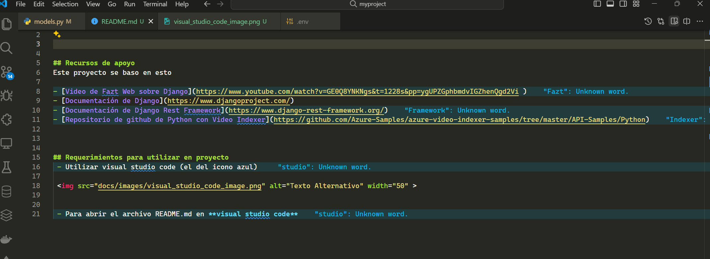

 - el archivo una vez que le diste click al boton de la lupa se vera asi

 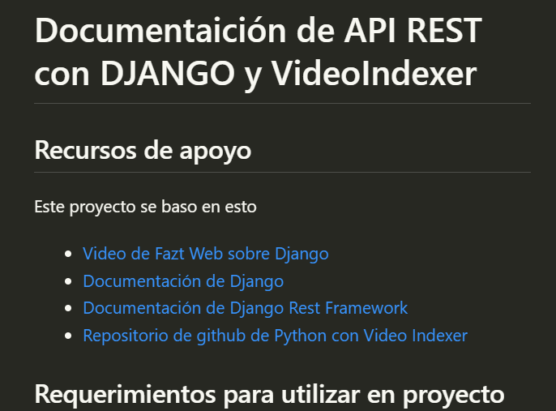

 - tener instalado `pip` en tu PC, si no lo tienes intalado investigar ¿como instalar `pip`?


 ## ¿Cómo ejecutar este proyecto?

- ejecutar para instalar las `dependencias` de este proyecto

````bash
pip install -r requirements.txt
````

- Despues, debes subir tu video a la portal de video indexer [https://www.videoindexer.ai/media/library](https://www.videoindexer.ai/media/library)


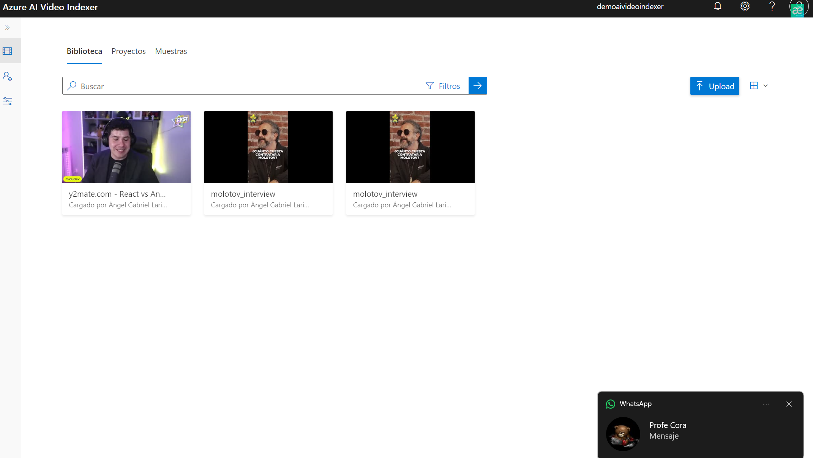

- Copiar el id del video indexado asi:

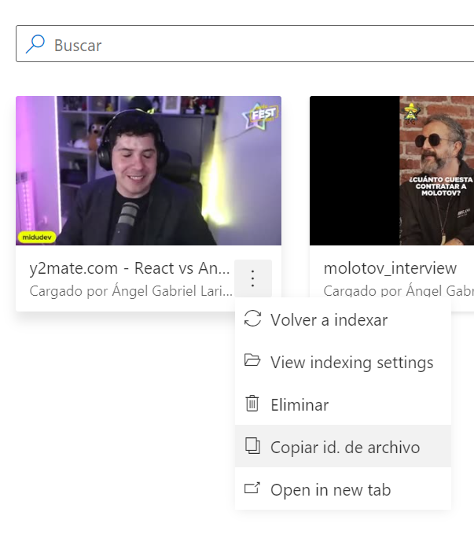

- El repositorio/proyecto tine un archivo de nombre `.env.example` ese archivo se va copiar nuevamente y camibiarlo a nombre solo `.env`

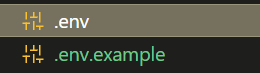


- Ahora el id del video que copiaron en el portal de videoindexer lo van pegar en esta variable que se llama `video_id` del archivo `.env`

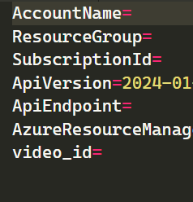

## ¿Como obtener las crendenciales de Video Indexer para las variables de entorno?
- ahora para las variables de `AccountName`, `ResourceGroup` y `SubscriptionId`, se obtiene al crear el recurso de Azure de nombre `Azure AI Video Indexer`

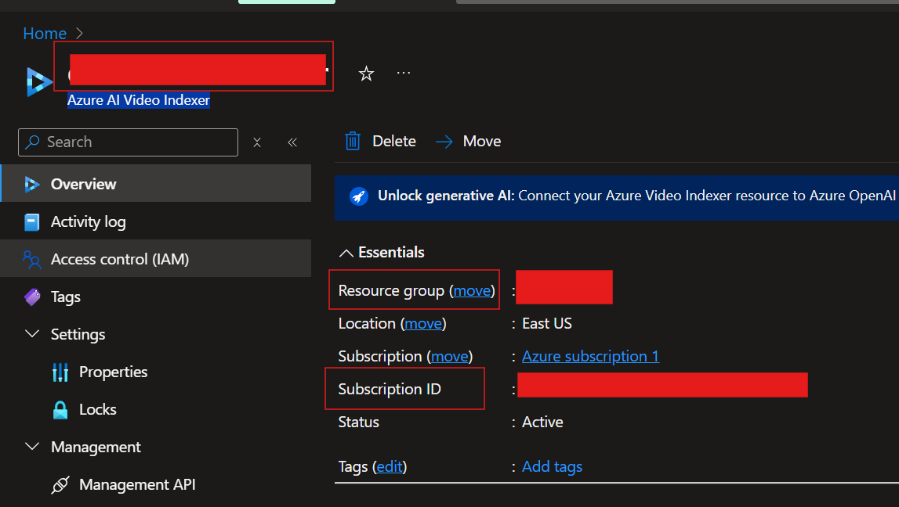


## ¿Como obtener las crendenciales de Video Indexer para las variables de entorno?

- ahora para la siguiente variables de entorno
    - `AZURE_OPENAI_API_KEY=`
    - `AZURE_OPENAI_ENDPOINT=`
    - `AZURE_OPENAI_API_VERSION`
    - `DEPLOYED_MODEL_NAME=`

 - `AZURE_OPENAI_API_VERSION` ya tiene un valor por defecto que es `2024-05-01-preview` pero puede cambiar a medida que pase el tiempo, consultar esto en [https://learn.microsoft.com/en-us/azure/ai-services/openai/reference](https://learn.microsoft.com/en-us/azure/ai-services/openai/reference)


- Para obtener `AZURE_OPENAI_API_KEY=``, AZURE_OPENAI_ENDPOINT=`, `AZURE_OPENAI_API_VERSION` se encuentra la info en esta imagen de tu servicio de Azure **Azure Open AI**

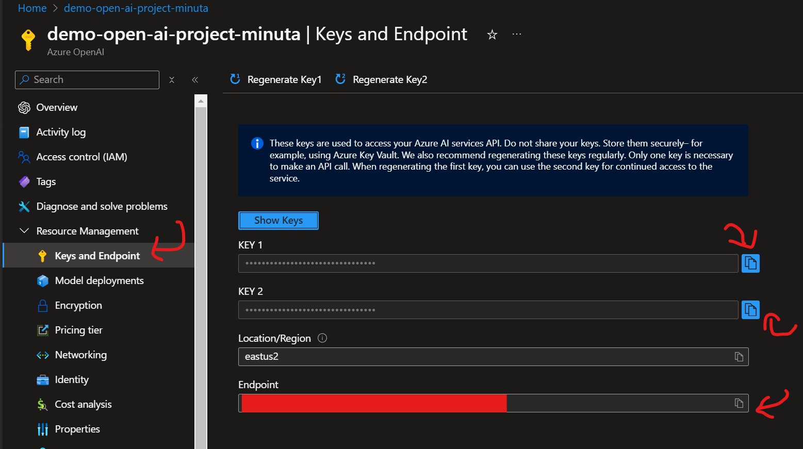


- Para obtener `DEPLOYED_MODEL_NAME` debes desplegar un modelo en [https://oai.azure.com/](https://oai.azure.com/) con e inicar sesión con tu cuenta de Azure y vincularlo con tu servicio de Azure Open AI que creaste

- Desplegar el modelo aqui:
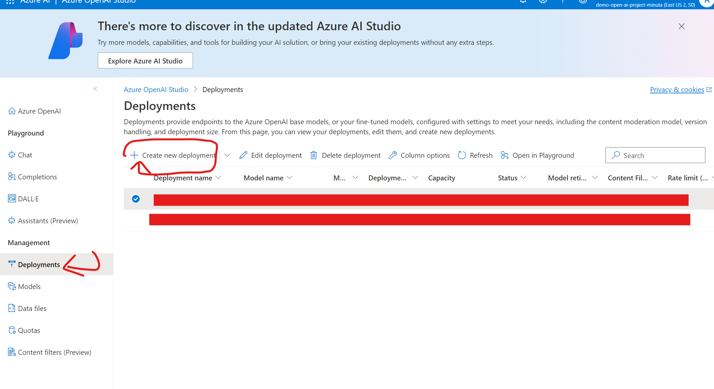

- Copiar el nombre de tu modelo desplegado para la ultima variable

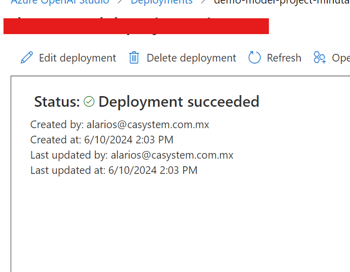

## Ejecutar el proyecto
- Abrir la terminal de visual studio code con `ctrl + j` o buscar `¿Cómo abrir una nueva terminal de Visual Studio Code`


- Ejeuctar estos de comandos de python

~~~bash
python manage.py makemigrations
~~~

~~~bash
python manage.py migrate
~~~


````bash
python .\manage.py runserver
````

 - si se ejecuto correctamente aparecera esto en la pantalla

 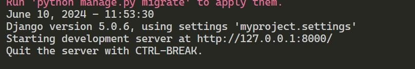

 - La dirección URL que te aparece en la consola te vas a dirigir ahi a tu navegador y debes acceder a esta ruta [http://127.0.0.1:8000/api/generate-minutes-of-video-meeting](http://127.0.0.1:8000/api/generate-minutes-of-video-meeting)

- Debes esperar un rato a que cargue la pagina y se descargará la minuta

# Notas
Por el momento se descarga un archivo markdown de extensión `.md` 

 

 